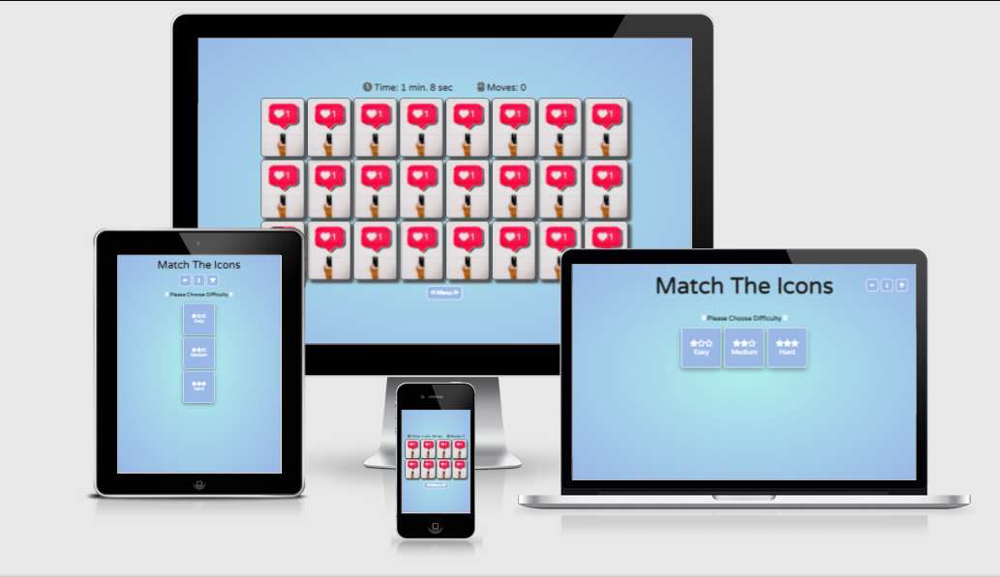

<h1 align="center">Matching The Icons</h1>

[View the live project here.](https://osvaldss.github.io/Matching-Game/)

This is a memory game (based on card matching) game scope to match all the cards. The game's purpose is to give a challenge for all players from easy to hard level to achieve the best possible score on all difficulties. Games run on a range of devices with responsive design.

<h2 align="center"></h2>

## User Experience (UX)

- ### User stories

    -   #### First Time Visitor Goals

        1. As a First Time Visitor, I want to understand the main purpose of the site.
        2. As a First Time Visitor, I want to be able easily navigate through the site.
        3. As a First Time Visitor, I want to get an idea what king of memory games it’s.
        4. As a First Time Visitor, I want to enjoy the content of the game.

    -  #### Returning Visitor Goals

        1. As a Returning Visitor, I want to see if there are any updates on the game.
        2. As a Returning Visitor, I want to see if there are any new challenges in the game.
        3. As a Returning Visitor, I want to easily get back into the game.

    -   #### Frequent User Goals

        1. As a Frequent User, I want to have some sort of progression in the game.
        2. As a Frequent User, I want to see my progress while playing the game.
        3. As a Frequent User, I want to be able to get and information when I beat my best score.

- ### Design

    -   #### Colour scheme
        - There are three main colors in-game light blue, white, and orange.
        - There are two text colors white and black. Each color is used to achieve the best contrast for users.
    -   #### Typography
        - For the whole page and game, I imported "Varela Round" to my style.css file from google fonts. And I used sans-serif as the fallback font if my imported font won't be imported.
    -   #### Imagery
        - Images used on the page were only to give an appealing look for the cards in the game.  There are 12 different images /icons of social media brands to create 2 pairs of the same icon to create a match. For the background used a simple radial gradient. 

- ### Wireframes

    - Game wireframe for medium/large screens - [View](assets/images/img_ReadMe/wireframe_lg_md_screens.png)
    - Game wireframe for small screens - [View](assets/images/img_ReadMe/wireframes_small_screens.jpg)

## Features

- ### Existing Features   

    - Responsive design on different screen devices.
    - All game content is on same one page
        - When a page is loaded users are welcomed by the Game starting screen. [View](assets/images/img_ReadMe/Welcome_screen.png)
        - When the user gets through the welcome screen music will start to play in the background (the game has sound effects). The user has the option to mute off/on the sound of the website. It's easily found on the main screen. [View](assets/images/img_ReadMe/Mute_btn_img.png) On the same spot there is two extra call to action buttons. Button with [[i]](assets/images/img_ReadMe/introduction_img.png) icon gives information about the game with a simple step guide. Thirs button open score board where user can keep track of his earned scores. [View](assets/images/img_ReadMe/score-board_img.png)
        - On the main screen, the user will have to choose between three difficulty levels. [View](assets/images/img_ReadMe/choose_diff_menu.png) After difficulty has been chosen game will start. [View](assets/images/img_ReadMe/game_started.png)
        Above the card container, there are two counters. The first counter counting time passed when the game started until the finish. The second counting moves/clicks.  How many moves it will take the user to match all cards. [view](assets/images/img_ReadMe/counters_img.png)
        And below the card container there is a call to action button, upon game start button will appear that will give a player an option to go back to the difficulty menu. [View](assets/images/img_ReadMe/menu_btn.png)
        - The game doesn’t have a game over option, instead it has a scoring system based on required time and moves to complete the level.
        - When the game is finished victory screen will pop up. Victory modal gives a star rating for the user based on the difficulty level that was completed. Additionally, the window gives the user earned score on the current match and the best score for comparison from previous games if played. [View](assets/images/img_ReadMe/victory_screen.png)

- ### Features to Implement

    - Implement a progressive system into the game to give a user earn something for the replayability (level up points/rewards system).
    - Implement a scoreboard that would track and compares scores locally or publicly.
    - Implement an option to give user possibility to create own design for game cards.
    - Option yo play game fullscreen.

## Technologies Used

- ### Languages Used

    - [HTML5](https://en.wikipedia.org/wiki/HTML5)
    - [CSS3](https://en.wikipedia.org/wiki/Cascading_Style_Sheets)
    - [JavaScript](https://en.wikipedia.org/wiki/JavaScript)

- ### Frameworks, Libraries & Programs Used

    1. [Google Fonts](https://fonts.google.com/specimen/Varela+Round?query=varela)
        - Used to import "Varela Round"  font into style.css file which is used as the main font for the game.
    2. [Font Awesome](https://fontawesome.com/)
        - Font Awesome Icons used to give a more appealing look for the page.
    3. [jQuery](https://jquery.com/)
        - jQuery was used to write a script. J's file for the game. That gave all functionality and interactivity to the game.
    4. [Git](https://git-scm.com/)
        - Git was used for version control by utilizing the Gitpod terminal to commit to Git and Push to GitHub.
    5. [GitHub:](https://github.com/)
        - GitHub is used to store the projects code after being pushed from Git.
    6. [Adobe-Affinity](https://affinity.serif.com/en-gb/photo/)
        - Used to style logo, edit pohtos and resize images for webpages.
    7. [Figma](https://www.figma.com/)
        - Used to create a wireframe / layout for a web page.

## Testing

- The W3C Markup Validator and W3C CSS Validator Services were used to validate landing page of the project to ensure there were no syntax errors in the project. 

   - [W3C Markup Validator](https://jigsaw.w3.org/css-validator/#validate_by_input)  - [Result](assets/images/img_ReadMe/html_markup_validator.png)
   - [W3C CSS Validator](https://jigsaw.w3.org/css-validator/#validate_by_input) - [Result](assets/images/img_ReadMe/CSS_validator.png)

- ### Testing User Stories from User Experience (UX) Section

    - #### First Time Visitor Goals

        1. As a First Time Visitor, I want to understand the main purpose of the site.
            1. Upon entering the page, the welcome screen will pop up with the game title and command to click the mouse to continue to the page. [Perview](assets/images/img_ReadMe/Welcome_screen.png)
            2. On main page there is a information button (letter "i" icon, mostly used shorthand that stand for information) that when clicked will give quick introduction aobut the game. [Preview](assets/images/img_ReadMe/information_btn.png)
            3. The browser tab has a gamepad favicon that can give a user an idea of what content it has.

        2. As a First Time Visitor, I want to be able easily navigate through the site.
            1. Page is easy to navigate because the layout of the page is very simplistic. [Perview](assets/images/img_ReadMe/information_btn.png)
            2. Going through each different layer users always are given an option to go back to the menu screen.
            3. Most call to action button has icons that have symbolistic meaning common for everyone or name what purpose it serves. [Symbolism](assets/images/img_ReadMe/Mute_btn_img.png) / [Button with name](assets/images/img_ReadMe/menu_btn.png)

        3. As a First Time Visitor, I want to get an idea what king of memory games it’s.
            1. The welcoming screen reveals with the title what type of game it is. [Preview](assets/images/img_ReadMe/Welcome_screen.png)
            2. On information section user is provided with short introduction about game. [Preview](assets/images/img_ReadMe/match_cards.png)
            3. Users can simply go and try the game. No additional actions are required.

        4. As a First Time Visitor, I want to enjoy the content of the game.
            1. The game has three difficulties so would fit for a lot of user taste from the casual player to challenger. [Easy](assets/images/img_ReadMe/easy_level.png), [Medium](assets/images/img_ReadMe/game_started.png) and [Hard](assets/images/img_ReadMe/hard_level.png)
            2. The player can easily switch difficulties whenever he wants it doesn't require finishing the game.

    - #### Returning Visitor Goals

        1. As a Returning Visitor, I want to see if there are any updates on the game.
            1. User can check information tab where all new would be updated.
            2. There is option to add new section on main page.

        2. As a Returning Visitor, I want to see if there are any new challenges in the game.
            1. All difficulties are shown on the main page. So any newly implemented challenges would be easily located there. So the user won't be missing it. [Main Screen](assets/images/img_ReadMe/choose_diff_menu.png)

        3. As a Returning Visitor, I want to easily get back into the game.
            1. Game offering easy level difficulty so it can't be played before going to onto harder level.
            2. The game doesn't punish for replayability so the game can be played as many times as the user wants and at any time switch back to the desired difficulty. 
        
    - #### Frequent User Goals 

        1. As a Frequent User, I want to have some sort of progression in the game.
            1. The user gets a score depending on game difficulty. And all scores are saved on scoreboard. [Scoreboard](assets/images/img_ReadMe/score-board_img.png)
            2. Users can try to achieve a 5 start rating in-game on each difficulty.

        2. As a Frequent User, I want to see my progress while playing the game.
            1. When each game type is completed given a score is compared to the previous one and kept on the scoreboard. So the player has his own best scores table depending on the difficulty he beat.
            2. Users can track their progress while playing the game by checking the time/action counter field at a top of the matching game. [Counter](assets/images/img_ReadMe/counters_img.png)

        3. As a Frequent User, I want to be able to get and information when I beat my best score.
            1. Player can always check his current record on scoreboard. [Scoreboard](assets/images/img_ReadMe/score-board_img.png)
            2. Scores are based on how quickly and how many moves were required to finish the level. At the end of the game, the victory screen will pop up. [Victory](assets/images/img_ReadMe/victory_screen.png)
            3. The victory window always keeps track of your previous and current game score.
            4. When a player beats his own record small badge will appear on the victory window to inform that player beat his previous record.

- ### Further Testing

    - The Game page was tested on Google Chrome, Microsoft Edge, CClean browser and Firefox.
    - Used google chrome dev tools Lighthouse to check website accessibility and performance on mobile devices and on desktop. [Lighthouse](assets/images/img_ReadMe/lighthouse.png)
    - Used google chrome dev tools to console.log steps of code to make sure they wokring. [Console](assets/images/img_ReadMe/consolelog.png)
    - The game was tested on different devices: Desktop, Laptop, Samsung Galaxy A21s, Samsung Galaxy S7, Xiaomi POCO F3 and Samsung Galaxy Tab S2.
    - Game functionality was tested that all call to action buttons was working correctly.
    - All three game difficulties replayed many times to make sure all 5 stars were able to achieve (from no star result to 5 stars). And all game functionality works.
    - Most of the used functions have log option to return an error in the console window if the code runs incorrectly. [Code exmaple](assets/images/img_ReadMe/snip_code.png)


- ### Bugs 

    - Encounter a bug when the user could mark an icon and it would make all cards transparent. So a user could see all front cards and easily win game fixed it with (user-select: none).
    - Undefiend varialbles or wrong datatypes used so functions wouldnt work correctly.
    - After adding CSS classes to elements not include to remove method that later on in the process overlapping and displaying the incorrect amount of cars.


## Deployment

- ### GitHub Pages

    - The project was deployed to GitHub pages using following steps:
        1. Log in to [GitHub](https://github.com/)
        2. Navigate to your repository. First option you can find all you repositories stored on the top left side of the windows. Click on your user avatar icon top right side of page.
        3. Click on to the repository you want to deploy.
        4. At the top of the window look for a cog icon / settings and click it.
        5. On the left window side look for a section called Pages.
        6. At the GitHub pages under the "Source", click the dropdown menu, choose master branch instead of none and click save.
        7. And you will be able to see highlighted message your site is published.

- ### Forking the GitHub Repository

    - A GitHub fork is a copy of a repository that sits in your account rather than the account from which you forked the data from. Once you have forked it, you own your forked copy. This means that you can edit the contents of your forked repository without impacting original repository.
        1. Log in to [GitHub](https://github.com/)
        2. Just a little below you user avatar icon there is a button that forks repository.
        3. After you click the button it will fork your repository and you will have a copy.

- ### Making a Local Clone 
    - You can clone your repository to create a local copy on your computer and sync between the two locations.
        1. Log in to [GitHub](https://github.com/) 
        2. Above the list of files, click dropdown menu "Code".
        3. To clone the repository using HTTPS, under "Clone with HTTPS", copy the link and pop up message will show up that link was copied.
        4. Open Git Bash terminal.
        5. Change the current working directory to the location where you want the cloned directory.
        6. Type git clone, and then paste link you copied from "Code" dropdown menu.
        7. Press Enter. Your local clone will be created.
        8. Upon sucesfuly created a your repository clone you will see following information in the terminal.
            ```
            $ git clone https://github.com/YOUR-USERNAME/YOUR-REPOSITORY
            > Cloning into `Spoon-Knife`...
            > remote: Counting objects: 10, done.
            > remote: Compressing objects: 100% (8/8), done.
            > remove: Total 10 (delta 1), reused 10 (delta 1)
            > Unpacking objects: 100% (10/10), done.
            ```

## Credits

- ### Code

    - [Stackoverflow](https://stackoverflow.com/) - Stackverflow asked for the help to create and image object and push it to the image array.
    - [Wikipedia](https://en.wikipedia.org/wiki/Fisher%E2%80%93Yates_shuffle) - Uset for shuffle cards before matching them.
    - [jQuery](https://jquery.com/) - jQuery was used to write a script. J's file for the game. That gave all functionality and interactivity to the game.

- ### Media

    - [Unsplash](https://unsplash.com/s/photos/like) - used to get a background image for the cards and social media icons.
    - [Freesound](https://freesound.org/) - used for background music and game sound effects.

- ### Acknowledgements

    - Code Institute
    - My Mentor for help regarding my queries.
    - Slack community
    - Stackoverflow


      